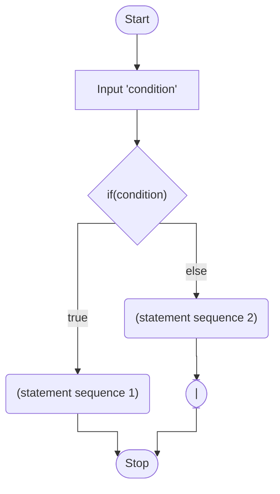
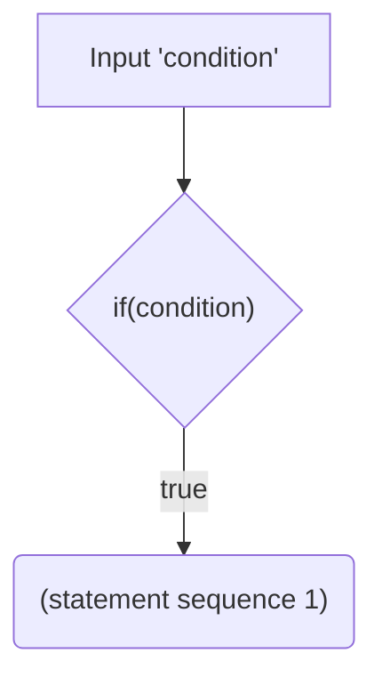
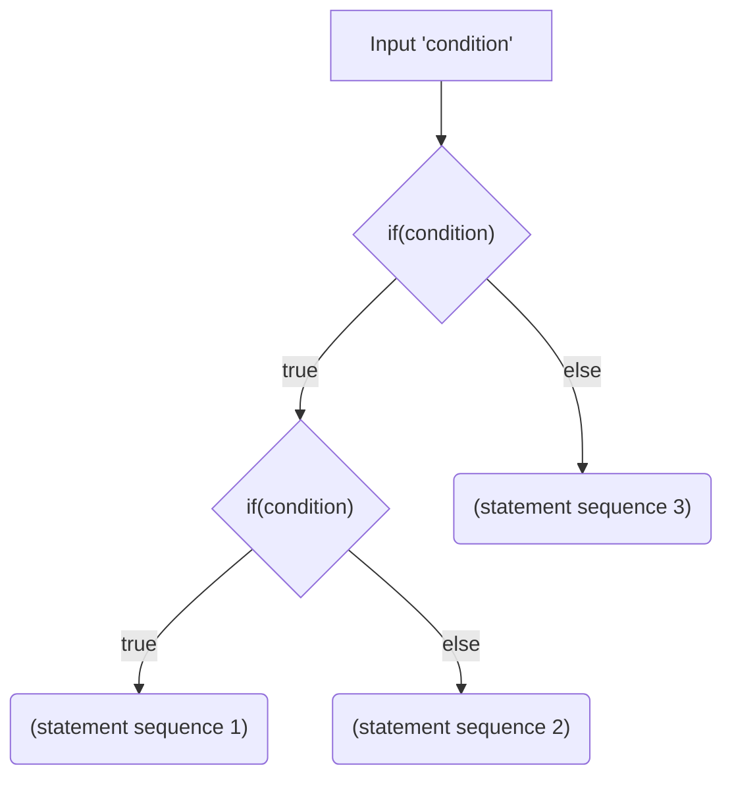
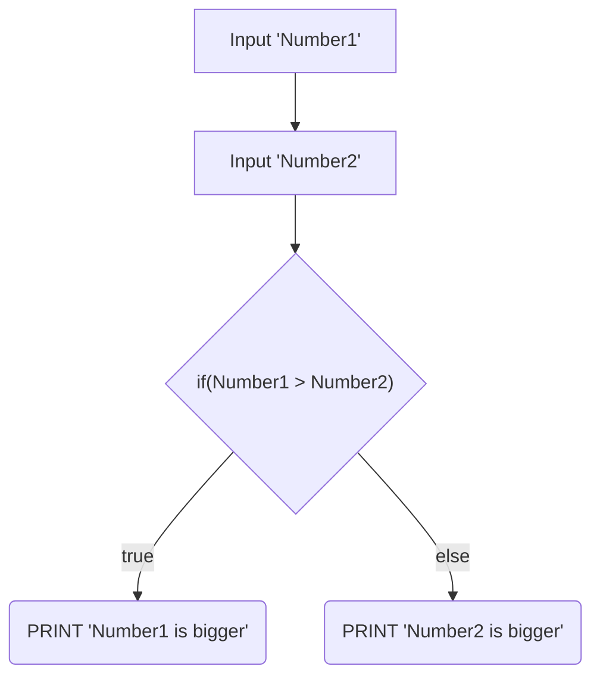
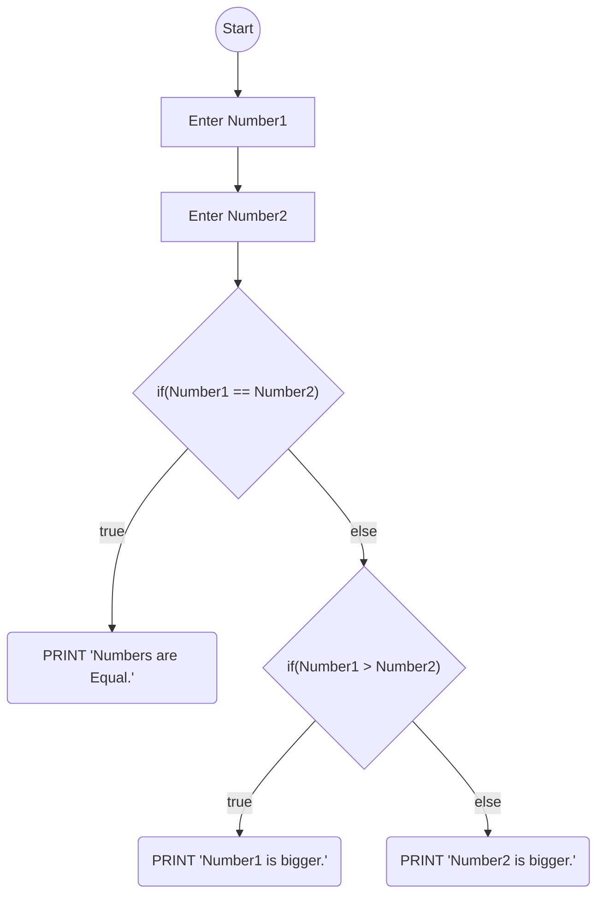

# 2 - Binary

## Question 1:

Binary Selection (with Two Pathways):


    

Binary Selection (with One Pathway):



Binary Selection (Nested Statements):




## Question 2:



## Question 4:

| **Number  1** | **Number 2** | **Expected output** | **Actual output** |
| ------------- | ------------ | ------------------- | ----------------- |
| 5             | 42           | 42 is bigger        | 42 is Bigger.     |
| 34            | 37           | 37 is bigger        | 37 is Bigger.     |
| 12            | 12           | Numbers are equal   | 12 is Bigger.     |

a) Does the program produce the expected output?

No, it does not, as the last row's expected output is not indicative of the actual output. This is as the PHP script does not contain the necessary logic to handle a situation when the two variables have the same value.


b) Describe what happens when no data is in the text boxes.

When there is no data, "is Bigger." is echoed. This is as one of the two same blank variables are considered bigger and is used in the echoed message.


## Question 4:

```pseudocode
BEGIN
    Enter Number 1 and enter Number 2
    IF Number1 = Number2 THEN
        PRINT Numbers are equal
    ELSE
        IF Number 1 > Number 2 THEN
           PRINT Number1 is bigger
        ELSE
           PRINT Number2 is bigger
        END IF
    END IF
END
```

a)  Write the flowchart algorithm for the above pseudocode.




