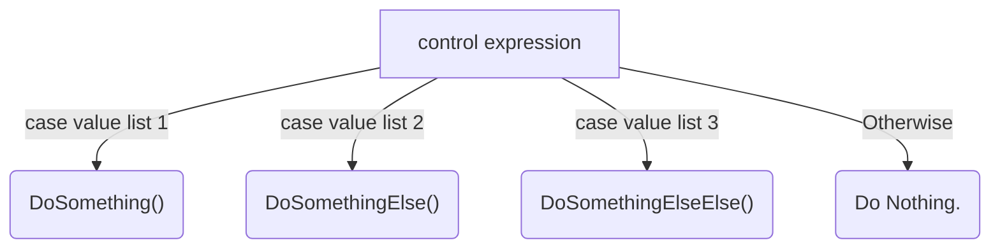

## Question 1

Draw the flowchart for the CASEWHERE control structure here:

```pseudocode
BEGIN
	CASEWHERE control expression
		(case value list 1)
		(case value list 2)
		(case value list 3)
		.....
	OTHERWISE
		(case value list last)
	ENDCASE
END
```




## Question 2

| **input(age)** | **Expected Output**  | **Actual Output**               |
| -------------- | -------------------- | ------------------------------- |
| 5              | "name" is in infants | "name" is in infants school.    |
| 9              | "name" is in primary | "name"  is in primary school.   |
| 13             | "name" is in middle  | "name"  is in secondary school. |
| 15             | "name" is in senior  | "name"  is in secondary school. |
| 18             | "name" is in senior  | "name"  is in senior school.    |
| 1              | "none"               | "name"  is in primary school.   |
| 24             | "none"               | None.                           |

No, as the logic is different for 15-18, as well as there is no logic to properly handle people under the age of primary students.