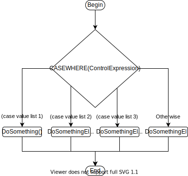

# 3 - Multiway

## Question 1

Draw the flowchart for the CASEWHERE control structure here:

```pseudocode
BEGIN
	CASEWHERE control expression
		(case value list 1)
		(case value list 2)
		(case value list 3)
		.....
	OTHERWISE
		(case value list last)
	ENDCASE
END
```


## Question 2

| **input(age)** | **Expected Output**  | **Actual Output**               |
| -------------- | -------------------- | ------------------------------- |
| 5              | "name" is in infants | "name" is in infants school.    |
| 9              | "name" is in primary | "name"  is in primary school.   |
| 13             | "name" is in middle  | "name"  is in secondary school. |
| 15             | "name" is in senior  | "name"  is in secondary school. |
| 18             | "name" is in senior  | "name"  is in senior school.    |
| 1              | "none"               | "name"  is in primary school.   |
| 24             | "none"               | None.                           |

No, as the logic is different for 15-18, as well as there is no logic to properly handle people under the age of primary students.


## Question 4

Modify the algorithm below so that if:
\- an age of 0 to 5 is entered then the output is - "name" to young for school.
\- an age of greater then 18 is entered then the output is - "name" has left school.

```pseudocode
BEGIN
   Enter Name; Name
   Enter Age; age
   CASEWHERE age
 
 
     CASE 5 to 7
        PRINT 'Name is in infants school'
     CASE 8 to 12
        PRINT 'Name is in primary school'  
     CASE 13 to 16
        PRINT 'Name is in middle school'
     CASE 17 to 18
        PRINT 'Name is in senior school'
 
     OTHERWISE
        PRINT 'None' 
   END CASE
END
```

```pseudocode
BEGIN
   Enter Name; Name
   Enter Age; age
   CASEWHERE age
 
	   CASE 0 to 5
	 	   PRINT 'Name is too young for school'
      CASE 5 to 7
         PRINT 'Name is in infants school'
      CASE 8 to 12
         PRINT 'Name is in primary school'  
      CASE 13 to 16
         PRINT 'Name is in middle school'
      CASE 17 to 18
         PRINT 'Name is in senior school'
      CASE > 18
     	   PRINT 'Name has left school'
 
      OTHERWISE
         PRINT 'None' 
   END CASE
END
```


## Question 6

```pseudocode
BEGIN
   	Enter Name; Name
   	Enter Age; age
  	IF age is between 0 and 5 THEN
    	PRINT 'Name is too young for school'
    ELSE
		IF age is between 5 and 7 THEN
    		PRINT 'Name is in infants school'
    	ELSE
        	IF age is between 8 and 12 THEN
        		PRINT 'Name is in primary school'
        	ELSE
                IF age is between 13 and 16 THEN
                	PRINT 'Name is in middle school'
                ELSE
                    IF age is between 17 and 18 THEN
                        PRINT 'Name is in senior school'
                    ELSE
                        IF age is more than 18 THEN
                        	PRINT 'Name has left school'
                        ELSE
                        	PRINT 'None'
                        END IF
                    END IF
                END IF
        	END IF
        END IF
   	END IF
END
```

