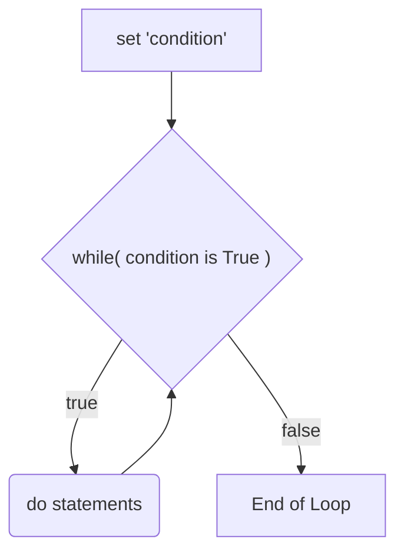
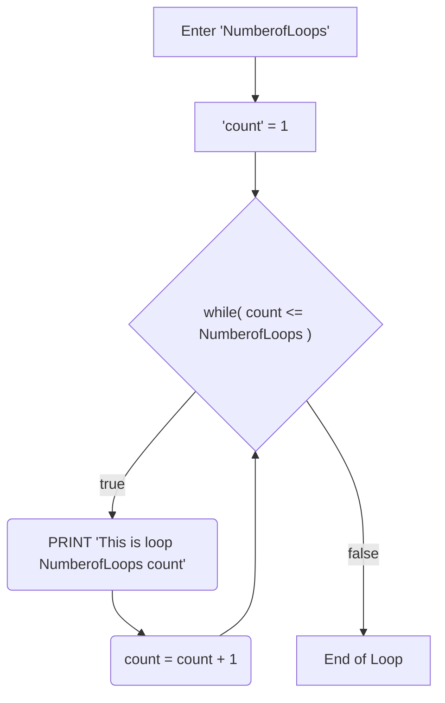

# 4 - PreTest

## Question 1

Draw flowcharts for these Pre-Test Loops: 

``` pseudocode
BEGIN
   set condition
   WHILE (condition is True)
	    (do statements)
   ENDWHILE
END
```



```pseudocode
BEGIN
   Enter NumberofLoops
   Set count = 1
   WHILE count <= NumberOfLoops
       PRINT This is loop NumberofLoops count
       count = count + 1
   END WHILE
END
```



## Question 2

Try this example in your web browser using the supplied code below. Complete the table below before proceeding to the next activity.

| **Enter  Number** | **Expected Output**                                          | **Actual Output**                                            |
| ----------------- | ------------------------------------------------------------ | ------------------------------------------------------------ |
| 5                 | Loop number;1 <br/>Loop number;2 <br/>Loop number;3  <br/>Loop number;4  <br/>Loop number;5 | Loop number 0 <br/>Loop number 1 <br/>Loop number 2 <br/>Loop number 3 <br/>Loop number 4 <br/>Loop number 5 |

Does the program produce the expected output? Why?

No, as the index for the loop starts at 0. Therefore, when counting from zero to five, there are 6 numbers including zero itself.


## Question 4

a) What is the code line $count = count + 1 doing? What is its purpose? 

The purpose is to iterate and increment the variable at each loop.


b) In the Algorithm the variable $count is set to zero at the beginning. What would happen if you set this to one?

If this were set to one at the beginning, the loop's iteration would start at one instead of zero. Hence the loop will start at 1, and end on the inputted value.


## Question 5

a) Try the example on the web site using the test data. Complete the table below. 

| **Enter  Number** | **Expected Output**                   | **Actual Output** |
| ----------------- | ------------------------------------- | ----------------- |
| - 4               | Error “only positive numbers allowed” |                   |

b)  Re-write the algorithm so that the error message appears if the user inputs a number below 1. The Error Message should say: "You are only allowed to enter positive numbers. Please try again"

``` pseudocode
BEGIN
   Enter NumberOfLoops
   IF NumberOfLoops < 1 THEN
   		PRINT You are only allowed to enter positive numbers. Please try again.
   ELSE
		Set count = 1
       	WHILE count <= NumberOfLoops
       	PRINT This is loop number count
       	count = count + 1
       	END WHILE
   ENDIF
END
```
