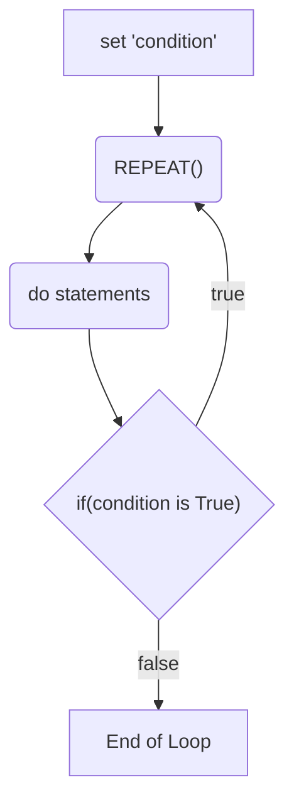

# 5 - PostTest

## Question 1:

```pseudocode
BEGIN
   REPEAT
      (do statements)
   UNTIL (condition is True)
END
```



```pseudocode
BEGIN
   Enter Number of Loops
   Set count = 1
   REPEAT
      PRINT This is loop number; count
      count = count + 1
   UNTIL (count >= NumberOfLoops)
END
```

