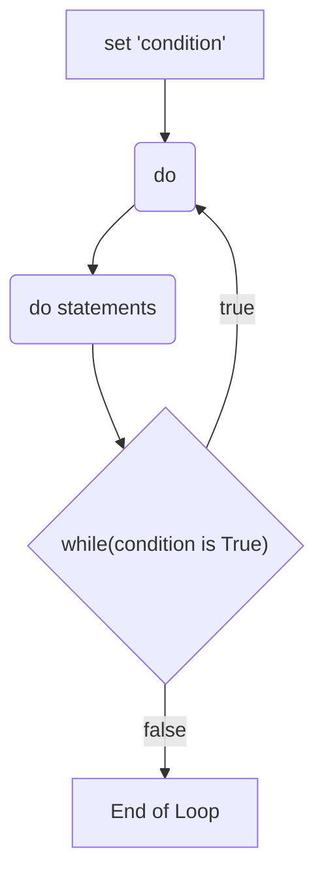
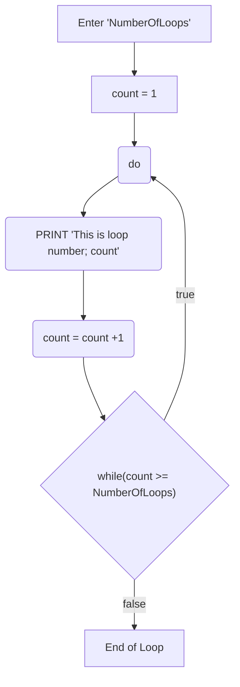

# 5 - PostTest

## Question 1:

```pseudocode
BEGIN
 REPEAT
(do statements)
 UNTIL (condition is True)
END
```



```pseudocode
BEGIN
 Enter NumberOfLoops
 Set count = 1
 REPEAT
 PRINT This is loop number; count
 count = count +1
 UNTIL (count >= NumberOfLoops)
END
```



## Question 2:

| Enter Number | Expected Output                                              | Actual Output                                                |
| ------------ | ------------------------------------------------------------ | ------------------------------------------------------------ |
| 5            | Loop number;1 <br/>Loop number;2<br/>Loop number;3<br/>Loop number;4<br/>Loop number;5 | Loop number; 0 <br/>Loop number; 1 <br/>Loop number; 2 <br/>Loop number; 3 <br/>Loop number; 4 <br/>Loop number; 5 |

Does the program produce the expected output? Why?

No, as the index for the loop starts at 0. Therefore, when counting from zero to five, there are 6 numbers including zero itself.


## Question 4:

The loops in the algorithm for the Pre-test and Post-test get the same result. Explain why there is a difference between the pseudocode "Condition statements" of a Pre-test Loop `(count <= NumberOfLoops)` and Post-test Loop `(count >= NumberOfLoops)`.

For a pretest loop, the code is only ran if count is less than or equal to the Number of Loops. Whilst on a Post-test loop, the code is constantly ran, until count is more than or equal to Number of Loops.


## Question 5:

| Input                 | Process                        | Output                                                       |
| --------------------- | -------------------------------- | ------------------------------------------------------------ |
| number 1<br/>number 2 | Loop from number 1 to number 2 | Print each loop number until number of loops entered is reached |


| **Enter Number** | **Counter** | **Expected Output** | **Actual Output**                  |
| ---------------- | ----------- | ------------------- | ---------------------------------- |
| 5                | 5           | 5                   | Loop number; 5                     |
| 7                | 6           | 6                   | Loop number; 6 <br/>Loop number; 7 |
|                  | 7           | 7                   | Loop number; 7                     |