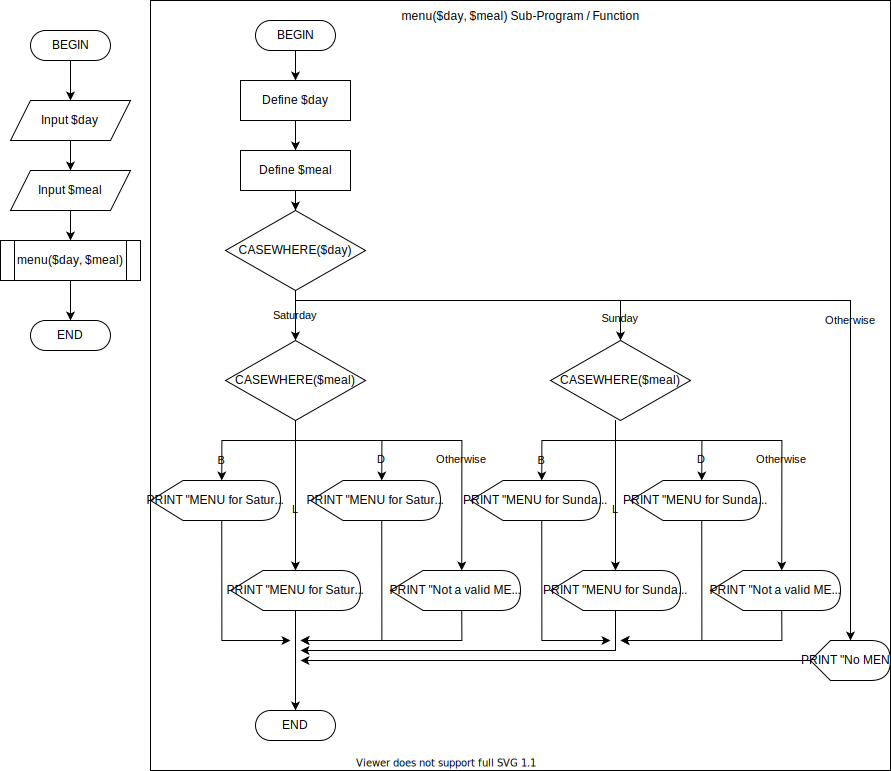

# 6 - Functions

## Question 1:

| **Day**  | **meal** | **Expected Output**            | **Actual Output**               |
| :------- | -------- | ------------------------------ | :------------------------------ |
| Saturday | B        | "MENU for Saturday: Breakfast" | "MENU for Saturday: Breakfast"  |
|          | L        | "MENU for Saturday: Lunch"     | "MENU for Saturday: Lunch"      |
|          | D        | "MENU for Saturday: Dinner"    | "MENU for Saturday: Dinner"     |
| Sunday   | B        | "MENU for Sunday: Breakfast"   | "MENU for Sunday: Breakfast"    |
|          | L        | "MENU for Sunday: Lunch"       | "MENU for Sunday: Lunch"        |
|          | D        | "MENU for Sunday: Dinner"      | "MENU for Sunday: Dinner"       |
|          | M        | “Not a valid menu for Sunday”  | "Not a valid MENU for Saturday" |
| Friday   | B        | “No Menu”                      | "No MENU"                       |
|          |          |                                |                                 |

## Question 2:

(a) Does the program produce the expected output?

Yes

(b) Name the parameters used in the example function in the PHP code below:

\$day and \$meal.

