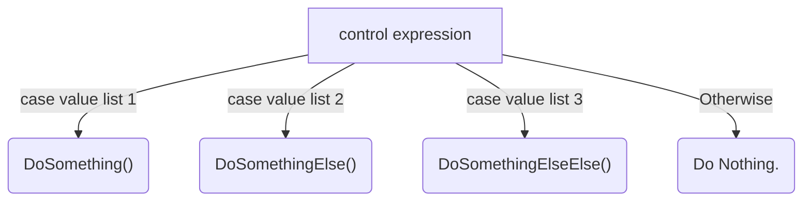

# This is a Folder for my PHP School Assignments.

## Index:
1. [Forms](1forms/) 
2. [Binary](2binary/) 
3. [Multiway](3multiway/) 
4. [PreTest](4pretest/) 
5. [PostTest](5posttest/) 
6. [Functions](6functions/) 
7. [Arrays](7arrays/) 
8. [Challenge](8challenge/) 

These answers are all typed in markdown. So you can do things like this:


=

```
graph TD
	A["control expression"]
	B("DoSomething()")
	C("DoSomethingElse()")
	D("DoSomethingElseElse()")
	E("Do Nothing.")
	
	A --> |case value list 1| B
	A --> |case value list 2| C
	A --> |case value list 3| D
	A --> |Otherwise| E
```

$$
\frac{-b\pm\sqrt{b^2-4ac}}{2a}
$$
``` tex
$$
\frac{-b\pm\sqrt{b^2-4ac}}{2a}
$$
```


​	