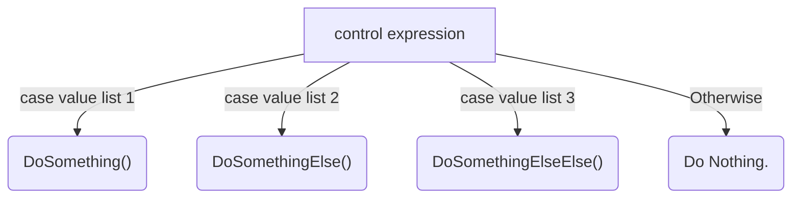

## This is a Folder for my PHP School Assignments.

Index:

1. [Forms](1forms\README.md) 
2. [Binary](2binary\README.md) 
3. [Multiway](3multiway\README.md) 
4. [PreTest](4pretest\README.md) 
5. [PostTest](5posttest\README.md) 

These answers are all typed in markdown. Watch me do these cool things:

$$
\frac{-b\pm\sqrt{b^2-4ac}}{2a}
$$

​	